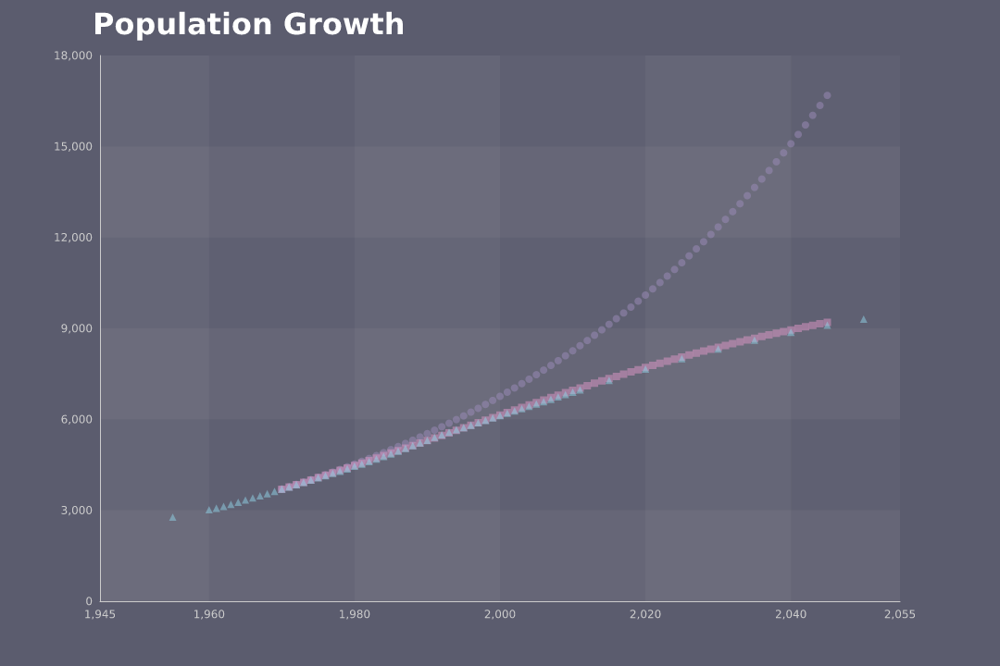

# 世界人口増加シミュレーション

## マルサスの人口増加モデル

- 出生数: $aN(t)\Delta t$ ($a$は定数)
- 死亡数: $bN(t)\Delta t$ ($b$は定数)

$N(t + \Delta t) - N(t) = aN(t)\Delta t - bN(t)\Delta t = (a-b)N(t)\Delta t = cN(t) \Delta t$  
$N(t + \Delta t) = N(t) + cN(t)\Delta t = (1 + c\Delta t)N(t)$

## ヴェアフルストの人口増加モデル

- 出生数: $aN(t)\Delta t$ ($a$は定数)
- 死亡数: $eN(t)N(t)\Delta t$ ($e$は定数)

$N(t + \Delta t) - N(t) = aN(t)\Delta t - eN(t)N(t)\Delta t$  
$N(t + \Delta t) = (1 + a\Delta t - eN(t)\Delta t)N(t)$

